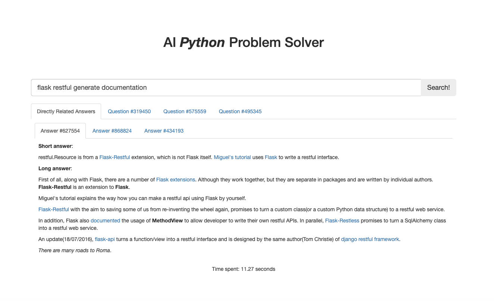

# PythonProblemSolver
A Python question searcher application written in Python3 using Flask. Using Kaggle database [stackoverflow/pythonquestions](https://www.kaggle.com/stackoverflow/pythonquestions).

## Init Server

Please create a `data` folder and place the above data in it. Then, start Flask engine, access [`http://[ip]:[port]/init`](http://127.0.0.1:2345/init) via browser (or equivalent tools). Wait for cache to generate. During generating data, nothing will be shown and the browser will keep loading the page, and when its done, it will return the total time spent.

After that, you can directly go to [`http://[ip]:[port]`](http://127.0.0.1:2345) and use the provided GUI.

## Screenshot

